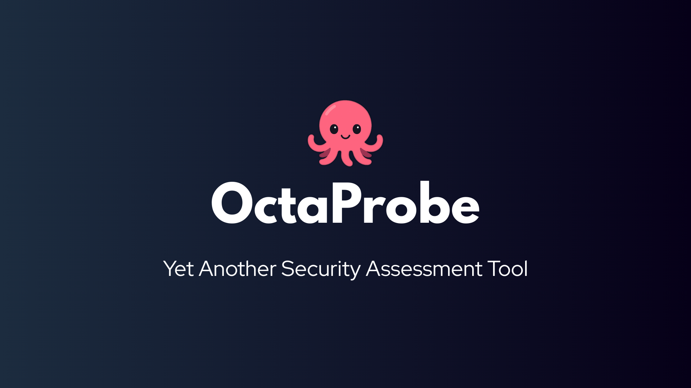

<div style="text-align: center; width: 100%;">
    
</div>

<br>
<div align=center> 


### Repository Statistics


### Target Operating Systems


</div>

<br><br>

## 🎥 Demo Video

To see OctaProbe in action, click on the demo video below:

<div align="center">

[](https://www.youtube.com/watch?v=13AFKNG8OL4)


</div>

>💡 **Test the App Online**  
You can try out OctaProbe directly in your browser by visiting [OctaProbe](https://octaprobe.streamlit.app/).
Note: Limited functionality on the testing version!

<br><br>

## ❓ What is it?

OctaProbe is a lightweight and efficient vulnerability scanner designed to identify security weaknesses in various systems. Built with Python and leveraging modern frameworks like Streamlit, it provides an intuitive interface for users to perform scans and analyze results. OctaProbe supports multiple operating systems, making it a versatile tool for developers, security analysts, and IT professionals.

<br><br>

## 🚀 How to Install?

> Before proceeding, ensure you have a basic understanding of the command line and that Git is installed on your system. If Git is not installed, follow the [official Git installation guide](https://git-scm.com/book/en/v2/Getting-Started-Installing-Git).  (Not to be confused with GitHub Desktop!)

> 💡 **Need a tailored guide?**  
> Refer to the [Project Wiki](https://github.com/NONAN23x/Octaprobe/wiki) for detailed, platform-specific instructions.

<br>

1. Clone the repository:
    ```bash
    git clone https://github.com/NONAN23x/Octaprobe.git
    cd Octaprobe
    ```

2. Install `uv` package manager:
    
    For Windows:
    ```powershell
    pip install uv
    ```
    For Linux distros with pipx:
    ```bash
    pipx install uv
    ```
    > 💡 **Note**  
     For detailed installation instructions for specific operating systems, please refer to the [Project Wiki](https://github.com/NONAN23x/Octaprobe/wiki)! We're excited to help you get started!

    - (Optional) Run setup.py with uv to initialize local llm:
        ```bash
        uv run setup.py
        ```
        > ⚠️ The script ensures that all required libraries are installed and that the Ollama service is properly set up. The setup script will automatically check for Ollama's installation and configuration. If Ollama is not installed or configured, the script will redirect you to the [Ollama Documentation](https://ollama.com/) for guidance. Please ensure the service is active and accessible to avoid any runtime issues.


3. Run the application:  
    ```bash
    uv run streamlit run app.py
    ```

<br><br>

## 🤝 Contributing
> We welcome contributions from the community! Before you begin, please take a moment to read the [CONTRIBUTING.md](https://github.com/NONAN23x/Octaprobe/blob/main/CONTRIBUTING.md) and [ROADMAP.md](https://github.com/NONAN23x/Octaprobe/blob/main/ROADMAP.md) files in the repository to understand the project's guidelines and future plans.

After you've read the above documents, here's how you can contribute:

1. **Fork the Repository**:  
    Click the "Fork" button at the top-right corner of this repository to create your own copy.

2. **Clone Your Fork**:  
    ```bash
    git clone https://github.com/your-username/Octaprobe.git
    cd Octaprobe
    ```

3. **Create a Branch**:  
    Create a new branch for your feature or bug fix.  
    ```bash
    git checkout -b feature-name
    ```

4. **Make Changes**:  
    Implement your changes and commit them with a descriptive message.  
    ```bash
    git add .
    git commit -m "Add a brief description of your changes"
    ```

5. **Push Changes**:  
    Push your changes to your forked repository.  
    ```bash
    git push origin feature-name
    ```

6. **Submit a Pull Request**:  
    Open a pull request to the main repository. Provide a clear description of your changes and why they should be merged.
